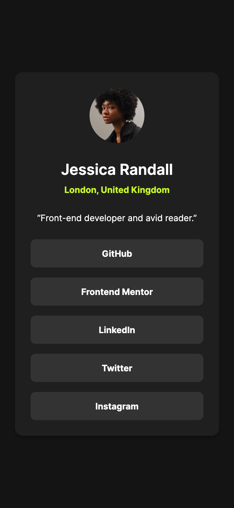
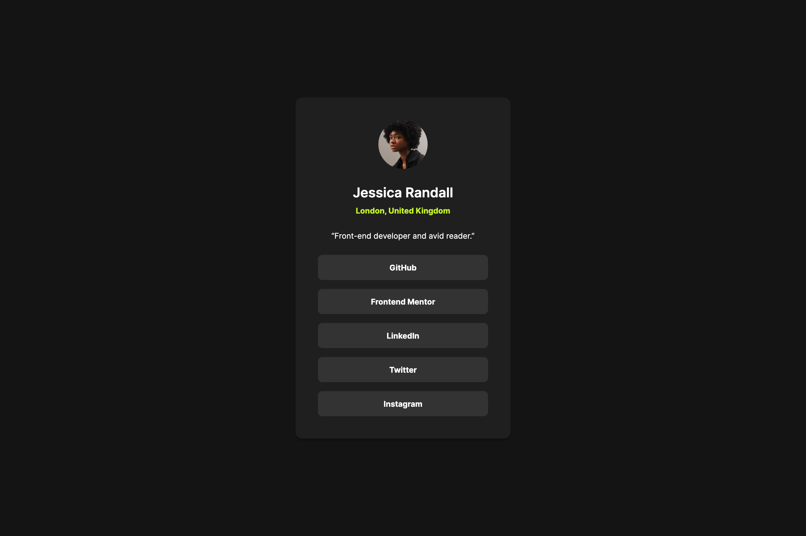
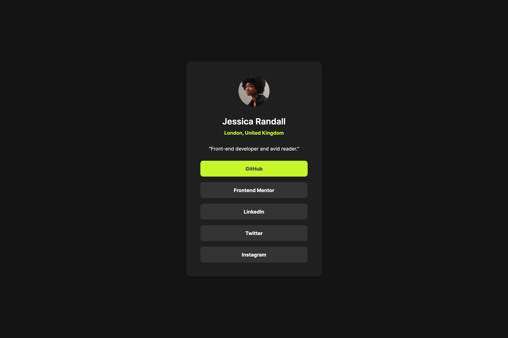

# Frontend Mentor - Social links profile solution

This is my solution to the [Social links profile challenge on Frontend Mentor](https://www.frontendmentor.io/challenges/social-links-profile-UG32l9m6dQ), a platform that helps you improve your coding skills by building realistic projects.

## Table of contents

- [Overview](#overview)
  - [The challenge](#the-challenge)
  - [Screenshots](#screenshots)
  - [Links](#links)
- [My process](#my-process)
  - [Built with](#built-with)
  - [What I learnt](#what-i-learnt)

## Overview

### The challenge

Users should be able to:

- See hover and focus states for all interactive elements on the page

### Screenshots

Mobile:



Desktop:



Desktop Hover State:



### Links

- [Solution URL](https://www.frontendmentor.io/solutions/social-links-profile-using-flexbox-and-clamp-bf8QE4h7lo)
- [live site URL](https://social-links-profile-plum-one.vercel.app/)

## My process

### Built with

- Semantic HTML5 markup
- CSS custom properties
- Flexbox
- Mobile-first workflow

### What I learnt

I was conflicted about whether the card image should be considered important content or not. Since the user's name appears directly below the image as a heading, using it as the `alt` text felt redundant.

Initially, I planned to leave the `alt` attribute empty, treating the image as decorative. However, I ultimately decided that the image is meaningful content and deserves a proper description. I tried to write an `alt` text that accurately conveys the image without being too verbose for screen readers.

```html

```

I also chose to use the `q` (inline quotation) element to represent the user's quote. This element is meant for short inline quotations, and most modern browsers automatically wrap the enclosed text in quotation marks, which aligns nicely with the design.

```html
<p class="card__description">
  <q>Front-end developer and avid reader.</q>
</p>
```

Lastly, in the design, the card has smaller padding on mobile, and the padding increases for larger screens (tablet and desktop).

At first, I considered using a `min-width` media query for this, but decided instead to use the `clamp()` function. This allows the padding to scale fluidly between a minimum and maximum value depending on the viewport width, without needing a separate media query for just one property.

```css
padding: clamp(var(--space-300), 19.4286px + 1.4286vw, var(--space-500));
```
